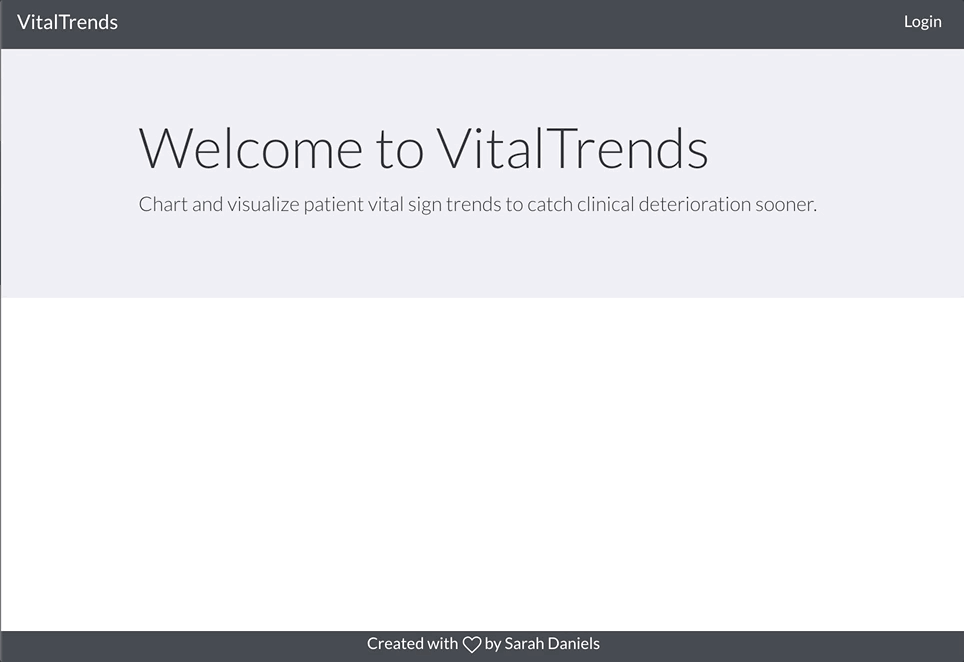
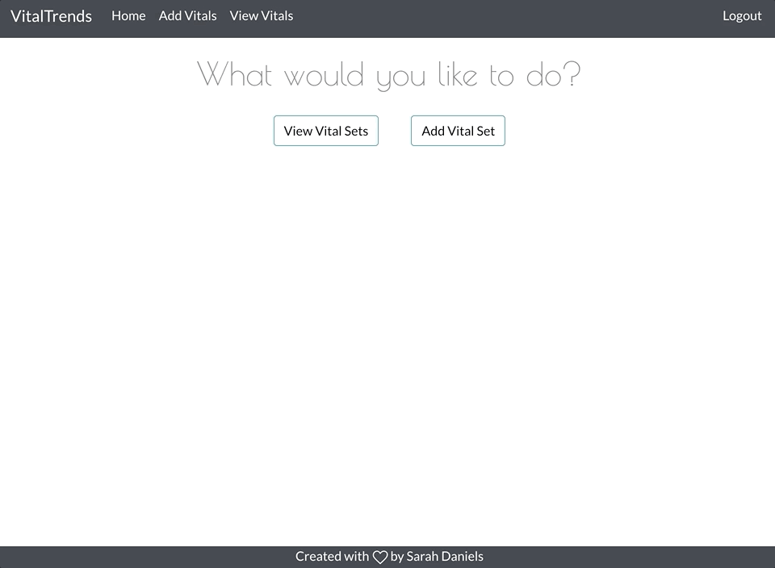
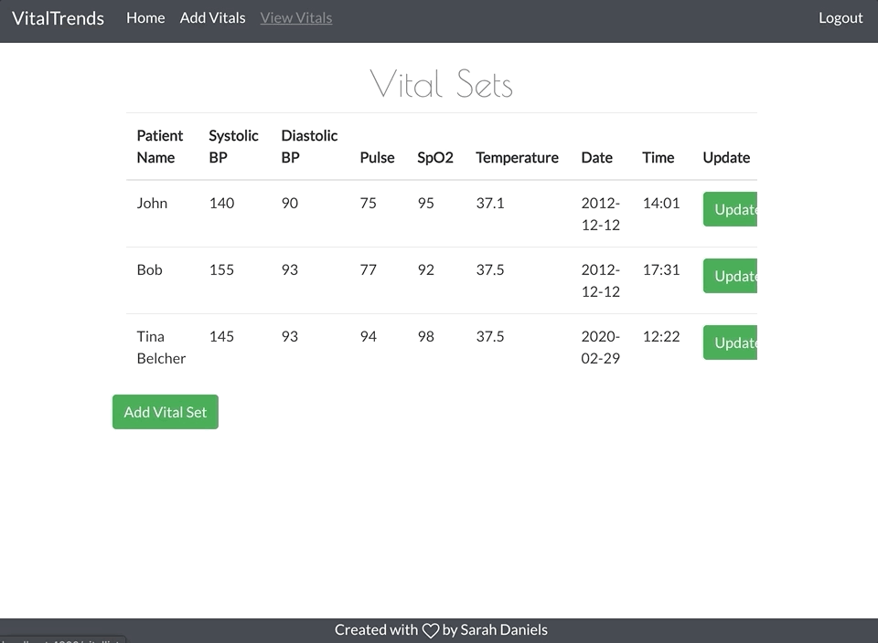
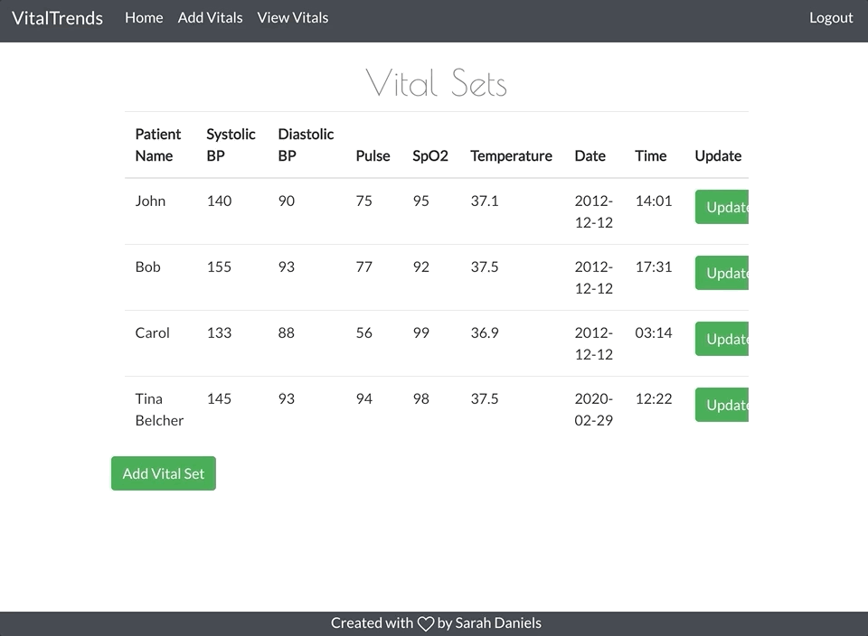

# What is Vital Trends?

**Vital Trends is an application for recording and visualizing patient vital sign trends.**

As a healthcare provider, mananging patient care can be overwhelming and requires a lot of attention to detail. There are a lot of factors that go into a well-oiled human machine - lab values and vital signs within a healthy range, physical therapy and exercise, and psychological and social care, just to name a few. 

Vital signs are the most immediately important, quantifiable factor in keeping a human stable. They can crash quickly. Early detection and intervention is key to preventing further deteriorattion and possible damage to body systems. 

Better stated in the article "The value of vital sign trends in predicting and monitoring clinical deterioration: A systematic review"... 

>> "Vital signs, i.e. respiratory rate, oxygen saturation, pulse, blood pressure and temperature, are regarded as an essential part of monitoring hospitalized patients. Changes in vital signs prior to clinical deterioration are well documented and early detection of preventable outcomes is key to timely intervention."

Check it out [here.](https://www.ncbi.nlm.nih.gov/pmc/articles/PMC6333367/pdf/pone.0210875.pdf)

Patients can also use this application to track their own vital signs, whether it be out of curiosity or to manage a condition like hypertension or COPD.

# What Inspired This Application? 

I'm a neurology ICU nurse. In an ICU, we have patients hooked up to monitoring equipment 24/7. While this is great to provide a constant insight into how the patient is doing, **it results in a large amount of data to look over.**

Reviewing tens, possibly hundreds, of vital sign sets for different patients over the course of a 12-14 hour shift (often at 3am) is difficult. It's tougher to make connections and see potential patient decline.

This application will eventually implement charts for the user to easier visualize patient improvement or decline based on different vital signs. As a visual learner myself, a lot of numbers can begin to bleed together aftere a long shift. Charts and other forms of data visualiztion will help keep clinicians on top of patient progress and promote patient safety.

# Installation 
1. Begin by cloning and install the backend [here.](https://github.com/sarahsakordaniels/vital-trend-be)

2. After cloning the frontend repo, run npm install to install any dependencies.

3. Run npm start to boot up the application.

# Application in Action 

## Login

---

## View Vitals

---

## Add Vital Set

---

## Update Vitals

---

## Delete Vitals

---

## Logout

# Built With
- **Maven** - dependency management
- **Spring Boot**- backend Java framework
- **React** - frontend JavaScript framework

# Future Implementations
- Currently in progress: the user will be able to use charts to visualize patient data.
- Include more patient data like lab values from blood work. 
- Include an option  to write comments on patients or a specific vital/vital set.
- Suggestions welcome!

# Contact Me
sarahsakordaniels@gmail.com

[LinkedIn](https://www.linkedin.com/in/sarahsakordaniels/)

[Medium](www.medium.com/@sarahsakordaniels)
